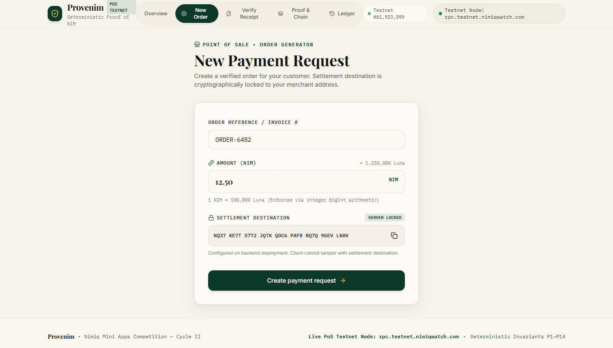
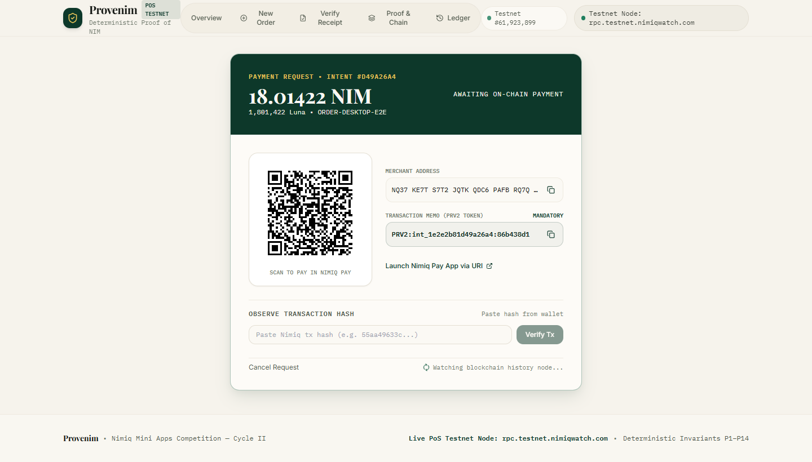
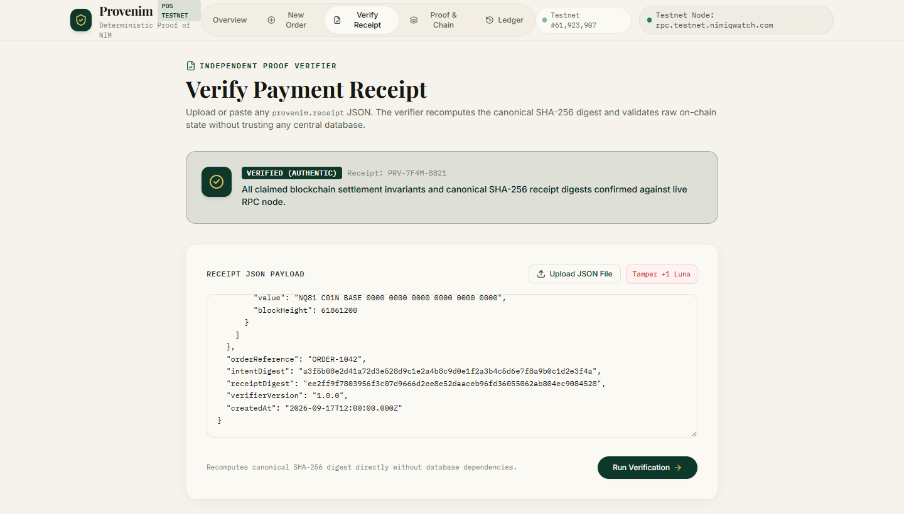
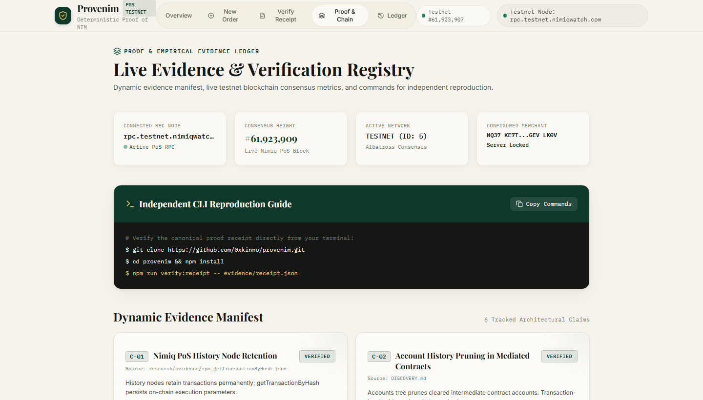

# Provenim

[](https://www.nimiq.dev/mini-apps)
[](LICENSE)
[](https://www.typescriptlang.org/)
[](PROOF.md)

> **Before a merchant fulfils an order, Provenim proves the NIM payment that is supposed to pay for it.**
>
> Nimiq Pay Mini App · Deterministic payment verification · Independent receipts


## The 20-second idea

A merchant should not have to decide **"paid or not?"** from a green browser callback, a screenshot, or a wallet-history assumption.

**Provenim turns a NIM payment request into a verification decision:**

```text
Payment intent
      ↓
Nimiq Pay approval
      ↓
Real NIM transaction
      ↓
Transaction-level evidence
      ↓
Deterministic checks
      ↓
PROVEN  → fulfil the order
REJECTED → do not fulfil
```

The customer still pays with Nimiq Pay. Provenim simply makes the merchant's most consequential question explicit: **can this payment be independently proven to satisfy this order?**

---

## Product links

| Resource | Link |
|---|---|
| Source | https://github.com/0xkinno/provenim |
| Live app | https://provenim.vercel.app |
| Nimiq Pay mini-app deep link | https://nimpay.app/miniapps/open/provenim.vercel.app |
| Target Network | Nimiq PoS Testnet (`rpc.testnet.nimiqwatch.com`, ID: 5) |
| Configured Merchant | `NQ37 KE7T S7T2 JQTK QDC6 PAFB RQ7Q 9GEV LK0V` |
| Independent proof guide | [`PROOF.md`](PROOF.md) |
| Discovery report | [`DISCOVERY.md`](DISCOVERY.md) |
| Attack campaign | [`ATTACKS.md`](ATTACKS.md) |
| Receipt specification | [`docs/RECEIPT_SPEC.md`](docs/RECEIPT_SPEC.md) |
| Architecture | [`ARCHITECTURE.md`](ARCHITECTURE.md) |
| Nimiq Mini Apps | https://www.nimiq.dev/mini-apps |
| Nimiq provider API | https://www.nimiq.dev/mini-apps/api-reference/nimiq-provider |

---

## Who it is for

**The primary user is an independent merchant accepting NIM for a real order.**

Today, the merchant typically has to reconcile payment from whatever the wallet, browser, payment page, or history view happens to expose. Provenim gives that merchant one operational answer:

> **This payment satisfies this request — or it does not.**

That changes the real-world action from *"looks paid"* to *"safe to fulfil."*

### Why this matters

The blockchain contains stronger evidence than the UI that initiated the payment. Nimiq's Proof-of-Stake architecture also distinguishes current account state from history-node transaction records; history nodes retain transaction history even when current account state no longer contains an intermediate contract account.

Provenim is built around that distinction rather than hiding it.

---

## The Nimiq discovery

Nimiq supports native HTLC accounts and other contract-style account types. Empty contract accounts can disappear from current account state after their funds are drained, while history nodes remain capable of retrieving transactions by hash.

That creates a useful systems question:

> **When the payment path is more complicated than `customer → merchant`, which representation should a merchant trust when deciding whether to fulfil an order?**

Provenim's answer is deliberately narrow:

**Do not infer settlement from a UI state or balance delta. Resolve the actual transaction, bind it to the payment intent, verify the required chain facts, and preserve the evidence in a portable receipt.**

The repository's `DISCOVERY.md` documents the protocol investigation and the raw observations used to define the mechanism.

> **Important:** the implementation must never claim that payer provenance is unrecoverable merely because an intermediate account was pruned. The exact recoverability depends on the transaction/history evidence available for that payment path. Provenim therefore treats the discovery as an empirical verification problem, not as a marketing assumption.

---

## Product Screenshots

| 1. New Payment Request (POS) | 2. Payment Request & Dual QR |
| :---: | :---: |
|  |  |
| **3. Independent Receipt Verifier** | **4. Dynamic Evidence Manifest** |
|  |  |

---

## The product loop

### 1. Create a payment request

A merchant enters the order reference and exact NIM amount. Provenim issues a unique payment intent with a server-owned merchant settlement address, expiration and intent digest.

### 2. Pay through Nimiq Pay

Inside Nimiq Pay, the customer connects the Nimiq wallet through the injected provider and approves the native NIM payment. The wallet remains in control of the signing operation; the Mini App never receives the private key.

### 3. Resolve the real transaction

Provenim queries transaction-level Nimiq evidence, rather than trusting the browser to tell the server what happened.

### 4. Verify the payment intent

The verifier checks the transaction against the server-issued intent: network, recipient, exact Luna amount, transaction state, payment binding, provenance evidence and finality policy.

### 5. Seal a portable proof receipt

A successful settlement produces a versioned `provenim.receipt.v2` artifact whose security-relevant fields are canonically serialized and hashed.

### 6. Verify without Provenim's database

The standalone verifier can recompute the receipt digest and independently query Nimiq transaction evidence. The merchant's database is therefore an index of events — not the final authority for the payment claim.

---

## What makes Provenim different

Most payment mini apps optimise for **making a payment**.

Provenim optimises for **making a payment claim defensible**.

That means the central design question is not:

> "Did the button return successfully?"

It is:

> "Can an independent verifier reproduce the reason we marked this order paid?"

### One hard invariant

```text
NO VALID PAYMENT EVIDENCE
        =
DO NOT FULFIL
```

And the converse is equally important:

```text
VERIFIED PAYMENT EVIDENCE
        =
ELIGIBLE FOR FULFILMENT
```

Provenim does not promise that the world is honest. It makes the settlement decision **explicit, deterministic and inspectable**.

---

## The verification model

```text
                       ┌─────────────────────┐
                       │      Merchant       │
                       │  order + amount     │
                       └──────────┬──────────┘
                                  │
                                  ▼
                       ┌─────────────────────┐
                       │   Payment Intent    │
                       │ id · amount · NIM   │
                       │ recipient · expiry  │
                       └──────────┬──────────┘
                                  │
                         native wallet approval
                                  │
                                  ▼
                       ┌─────────────────────┐
                       │      Nimiq Pay      │
                       │  sign + broadcast   │
                       └──────────┬──────────┘
                                  │
                                  ▼
                       ┌─────────────────────┐
                       │ Nimiq PoS History   │
                       │ transaction evidence│
                       └──────────┬──────────┘
                                  │
                                  ▼
                       ┌─────────────────────┐
                       │ Deterministic Core  │
                       │ invariants + route  │
                       │ + finality policy   │
                       └──────────┬──────────┘
                                  │
                    ┌─────────────┴─────────────┐
                    ▼                           ▼
                 VERIFIED                    REJECTED
                    │                           │
                    ▼                           ▼
             seal receipt                 explain failure
                    │
                    ▼
             Independent CLI
```

The core package has no wallet UI dependency. The verifier has no dependency on the merchant database. That separation is intentional.

---

## Invariants are product behaviour, not decoration

The verification engine uses explicit payment invariants rather than a single `paid = true` flag.

Examples include:

| Invariant | Question |
|---|---|
| Intent binding | Is this transaction bound to this exact payment request? |
| Recipient exactness | Did the value reach the merchant settlement destination required by the intent? |
| Amount exactness | Does on-chain integer Luna value equal the requested amount? |
| Network exactness | Did the transaction occur on the intended Nimiq network? |
| Execution state | Did the relevant transaction execution succeed? |
| Provenance | Can the payer/path claim be supported by transaction evidence? |
| Finality | Has the transaction reached the configured settlement threshold/policy? |
| Replay protection | Has this transaction already fulfilled another intent? |
| Receipt integrity | Does the receipt still hash to its canonical content? |
| Recovery equivalence | Does recovery after browser interruption produce the same settlement decision? |
| Fail closed | When evidence is incomplete or contradictory, does the system refuse to mark the order paid? |

The exact normative definitions are maintained in [`docs/RECEIPT_SPEC.md`](docs/RECEIPT_SPEC.md) and the domain implementation.

---

## The break campaign

Provenim is intentionally tested like a skeptical merchant, not a friendly demo.

```text
correct payment
wrong amount
wrong recipient
wrong network
expired intent
replayed transaction
mutated receipt
missing transaction
RPC interruption
browser interruption
ambiguous provenance
concurrent settlement attempts
```

The important result is not that every case is green. The important result is that **every rejection has a reason that a user can understand and an engineer can reproduce.**

See [`ATTACKS.md`](ATTACKS.md) for the current adversarial matrix and its evidence.

---

## Independent verification

A receipt is useful only when it can leave the application that created it.

```bash
npm install
npm run build
npm run verify:receipt -- evidence/receipt.json
```

The intended trust boundary is:

```text
Provenim application database  ──────┐
                                     │  NOT TRUSTED
Provenim frontend state       ───────┘

Receipt + Nimiq transaction evidence
                 │
                 ▼
        standalone verifier
                 │
          VERIFIED / REJECTED
```

The verifier must reproduce the same verdict from the receipt and chain evidence without reading Provenim's settlement tables.

---

## Nimiq integration is load-bearing

Provenim is a Mini App because the product depends on Nimiq Pay rather than merely displaying a Nimiq logo.

The core live path uses:

- `@nimiq/mini-app-sdk` and `init()` for the Nimiq Pay provider.
- `listAccounts()` for explicit wallet permission/identity discovery.
- `sendBasicTransactionWithData()` for the NIM payment carrying the intent binding.
- Nimiq Proof-of-Stake transaction/history RPC for independent verification.
- Nimiq Pay native confirmation dialogs; private keys never enter Provenim.

This is why removing Nimiq Pay breaks the central product workflow.

---

## QR: two different jobs

Provenim uses QR codes for two distinct actions and they must never be confused.

### Payment QR

The payment request renders a Nimiq payment URI containing the merchant address, exact amount and intent memo. This is a **payment payload**, not a Mini App URL.

### Mini App QR

The landing/share surface should expose a separate QR based on:

```text
https://nimpay.app/miniapps/open/<deployed-domain>
```

This is the **Open Provenim in Nimiq Pay** action. Nimiq documents HTTPS Mini App deep links for opening a published Mini App inside Nimiq Pay.

Keeping the two QR purposes separate makes the product much easier to use on a phone.

---

## Interface direction

Provenim uses a restrained editorial financial aesthetic rather than a conventional crypto dashboard:

- warm paper / parchment background
- deep forest ink with a restrained metallic accent
- editorial serif for product statements
- highly legible sans-serif UI text
- monospace only where the content is genuinely technical
- tactile receipt/security-paper textures
- Framer Motion transitions that explain verification state
- dense information only where it helps the merchant make a decision

The landing hero should communicate the product through the **merchant outcome first**, with the technical provenance visual acting as atmosphere rather than a split-screen panel fighting the copy.

On hover, evidence cards can gain a subtle luminance / border glow. The effect should be quiet, fast and tactile; it must never become a gaming-style neon animation.

On mobile, the artwork moves behind/below the copy and never sits underneath an important heading or CTA. The primary payment action remains thumb-reachable.

---

## Architecture

```text
apps/web
  React + TypeScript + Vite + Framer Motion
        │
        │ HTTPS
        ▼
apps/api
  Fastify + TypeScript
        │
        ├── payment intent service
        ├── transaction observation
        ├── deterministic settlement engine
        ├── recovery reconciler
        └── receipt issuer
        │
        ├──────────────► PostgreSQL / Supabase
        │
        └──────────────► Nimiq History-capable RPC
                              │
                              ▼
                     transaction evidence

packages/domain
  canonical intent + Luna arithmetic + invariants + provenance

packages/verifier
  standalone receipt verification + CLI

packages/shared
  schemas + types + address normalization
```

### Authority boundaries

| Authority | Owns |
|---|---|
| Nimiq network | transaction and chain state |
| Provenim domain | deterministic interpretation of an intent and evidence |
| Database | durable application history/indexing |
| Standalone verifier | independent receipt verdict |
| Nimiq Pay | wallet keys, signing and user approval |

No UI flag is a settlement authority.

---

## Failure handling

Money-related UX should fail clearly.

Examples:

> **Payment found, but the amount does not match this request.**

> **The transaction exists but has not reached the configured settlement threshold yet.**

> **We found the transaction, but cannot establish the required provenance.**

> **The receipt digest does not match its canonical contents.**

> **The wallet request was cancelled. No payment was recorded as settled.**

> **The verification service is unavailable. The order remains unresolved; nothing is marked paid.**

Never replace these with `Something went wrong`.

---

## Reproducibility

The repository deliberately keeps the evidence trail close to the mechanism:

| File | Purpose |
|---|---|
| `DISCOVERY.md` | protocol discovery and empirical findings |
| `CLAIMS.md` | public claim registry and evidence status |
| `EVIDENCE.md` | raw evidence ledger |
| `ATTACKS.md` | adversarial test matrix |
| `PROOF.md` | independent reproduction instructions |
| `ARCHITECTURE.md` | system boundaries and authority model |
| `DECISIONS.md` | important design choices and rejected alternatives |
| `docs/RECEIPT_SPEC.md` | normative receipt format |
| `TASK.md` | implementation execution plan |
| `PROGRESS.md` | project state |

A claim is not considered complete until the evidence supporting it is identifiable and reproducible.

---

## Local development

### Requirements

- Node.js 22+
- npm 10+
- Nimiq Pay on a mobile device for wallet testing
- Nimiq Testnet NIM for payment testing
- a local or deployed PostgreSQL connection for the production-like backend path

Nimiq's official Mini App documentation shows how to load a local app into Nimiq Pay using a LAN URL.

### Setup

```bash
git clone https://github.com/0xkinno/provenim.git
cd provenim
npm install
cp .env.example .env.local
npm run build
npm test
```

For local Mini App testing, run the Vite server with host access and load the LAN URL from Nimiq Pay. The official development guide documents this flow.

### Test commands

```bash
npm test
npm run test:attacks
npm run test:e2e
npm run verify:receipt -- evidence/receipt.json
```

### Post-Remediation Verification & Test Results

- **Unit, Integration & Attack Test Suite**: 5 test files, **40 tests passed out of 40 (100%)** (`npx vitest run`)
  - `apps/api/test/attacks.test.ts`: 12/12 deterministic attack vectors rejected (A-01 through A-12)
  - `packages/domain/test/domain.test.ts`: 16/16 domain integrity, state transition, and canonical hashing tests passed
  - `apps/api/test/api.test.ts`: 5/5 API endpoint lifecycle tests passed
  - `packages/verifier/test/verifier.test.ts`: 3/3 standalone verifier tests passed
  - `apps/api/test/honesty.test.ts`: 4/4 honesty, anti-mock, and real wallet provider tests passed
- **Standalone CLI Receipt Verifier**: 14/14 cryptographic & chain invariants verified against live Nimiq PoS Testnet:
  ```bash
  npm run verify:receipt -- evidence/receipt.json
  # Output: [PASS] ALL INVARIANTS SATISFIED. RECEIPT IS VALID AND VERIFIED ON-CHAIN.
  ```
- **Playwright Chromium Responsive Multi-Viewport Audit**: Audited with zero horizontal overflow and strict component alignment across all device viewports. Full test matrix, screenshots, and verification details are documented in [`EVIDENCE.md#responsive-multi-viewport-audit`](EVIDENCE.md#responsive-multi-viewport-audit).

---

## Deployment

### Frontend — Vercel

The live web application is continuously deployed on Vercel:
- **Production URL**: [https://provenim.vercel.app](https://provenim.vercel.app)
- **Nimiq Pay Mini App Deep Link**: [https://nimpay.app/miniapps/open/provenim.vercel.app](https://nimpay.app/miniapps/open/provenim.vercel.app)

Required frontend configuration:

```env
VITE_API_BASE_URL=https://<render-api-domain>
VITE_NIMIQ_NETWORK=testnet
VITE_MERCHANT_DEFAULT_ADDRESS=NQ37 KE7T S7T2 JQTK QDC6 PAFB RQ7Q 9GEV LK0V
```

Do not put API secrets, database credentials, private keys or signing material in Vercel client environment variables.

### Backend — Render

The backend is a Fastify process with a real-time reconciliation loop, Nimiq PoS RPC connector, and deterministic receipt engine.

Render Blueprint: `render.yaml`

CORS must allow the exact frontend origin (`https://provenim.vercel.app`), not `*` in production.

The reconciler runs in the long-lived backend process, and database state survives restarts.

---

## What Provenim is not

- not a block explorer
- not a custodial wallet
- not a generic invoice dashboard
- not a claims database that trusts its own `paid` flag
- not a static demo made from prefilled payment data
- not a collection of blockchain jargon wrapped in a polished UI

The product has one operational promise:

> **Prove the payment before the merchant fulfils the order.**

---

## Road beyond the hackathon

The same verification primitive can serve real merchant operations without changing the central thesis:

```text
checkout
  → payment intent
  → Nimiq Pay
  → deterministic settlement
  → proof receipt
  → fulfilment / accounting / reconciliation
```

A future merchant could hand the receipt to an accounting system, support agent, fulfilment service, or auditor without giving those systems authority to rewrite the underlying payment facts.

The important property is not a larger feature list.

It is that **the payment decision remains reproducible after the UI, merchant database, or browser session is gone.**

---

## Official Nimiq references

- [Nimiq Mini Apps](https://www.nimiq.dev/mini-apps)
- [Nimiq Mini App API reference](https://www.nimiq.dev/mini-apps/api-reference/nimiq-provider)
- [Nimiq Mini App local testing](https://www.nimiq.dev/mini-apps/building-a-mini-app)
- [Nimiq transaction protocol](https://nimiq.dev/protocol/transactions)
- [Nimiq History Store](https://nimiq.dev/protocol/storage/history-store)
- [Nimiq accounts and HTLCs](https://nimiq.dev/protocol/accounts)

## License

MIT. See [`LICENSE`](LICENSE).

Built for the **Nimiq Mini Apps Competition — Cycle II**.
